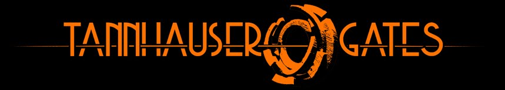
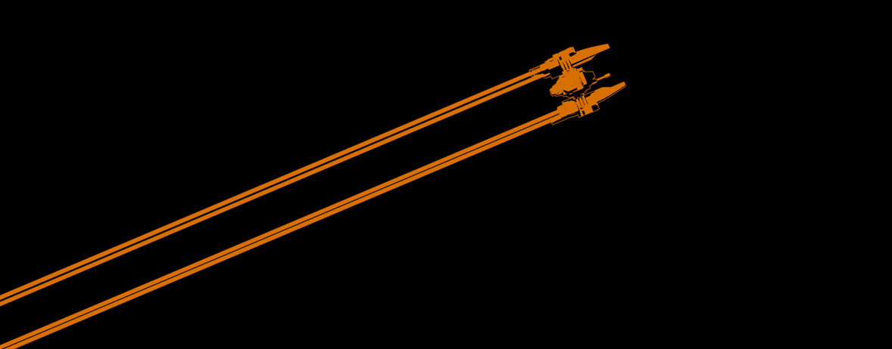

# Game prototype "Derelict Space"

_Derelict Space_ (working title) or _Tannhauser Gates_ is a gamedev project initiated during the year 2013.

- Main concept, game design and artistic direction: [Pascal Blanché](https://www.instagram.com/pascalblanche/)
- Coding, 3D integration, 2D gravitational physics: [François _astrofra_ Gutherz](https://github.com/astrofra)

> Tannhauser Gates is an RPG Top bottom Space Flight simulator game developed by SpaceCloud studio. What we want to achieve with this game is a complete experience where each and every aspect of the space game genre has been explored. From engine managing to spaceship customisation, crew hiring, missions, roleplay and trade. Our ambition is big and our studio is small ( a two man cell ) but we have the brains ( or so we think we have ) the experience and the ways to achieve our goal. This blog will be the place to follow us, from our first baby steps to the deep depthts of space and beyond!  
> _from [spacecloudstudio.blogspot.com](http://spacecloudstudio.blogspot.com/)_

## Preview

### Win32 prototype

- See the `releases` section

### Videos

- See a [Youtube preview to be found here](https://www.youtube.com/watch?v=4-dL8i0V58k)

